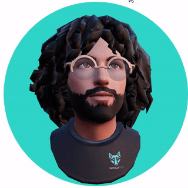
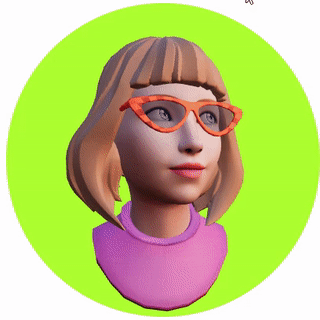
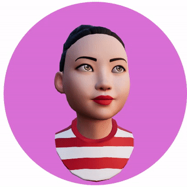

[](https://badge.fury.io/js/%40readyplayerme%2Fpersona)

# 3D Profile Avatars

Add your website a *3D Profile Avatar* using *Ready Player Me* with a single line of code!

Test it on CodeSandbox: https://codesandbox.io/s/avatar-view-wrn2u

---

 
 

## Install

- Run `npm i @sarge/avatar-view`

## Example

- First visit https://readyplayer.me and create a half-body avatar.

- Copy the url of the .glb file of the avatar you created.

- Import `AvatarView` to your file.

- Add `<AvatarView type={type} url={url}/>` component yo your return content 

```tsx
import { AvatarView } from "@sarge/avatar-view";

const type = "3D";
const url = "https://models.readyplayer.me/62ea7bc28a6d28ec134bbcce.glb";

export default function App()
{
  return <AvatarView type={type} url={url}/>
}
```

If you are using `Next.js` make sure to import the component dynamically using `ssr: false` parameter.

```tsx
const AvatarView = dynamic(async () => (await import('@sarge/avatar-view')).AvatarView, { ssr: false })
```

## Parameters of AvatarView
- **type** (*"2D" | "3D"*):

    Type of the avatar 2D image or 3D model avatar.
    
- **url** (*string*): 

    Url of the Ready Player Me avatar to load. This parameter is mandatory.

- **style** (*React.CSSProperties*) [optional]: 

    Style of the avatar view canvas. Here you can change the border style, background color or image, width, height and other style options.

- **options2D** (*Options2D*) [optional]:

    Options for `type` "2D" avatar.

    - **scale** (*Vector2*) [optional]: 
    
        Scale of the 2D avatar image.

    - **position** (*Vector2*) [optional]:

        Position of the 2D avatar in pixels.

- **options3D** (*Options3D*) [optional]:

    Options for `type` "3D" avatar.

    - **quality** (*Quality*) [optional]: 
    
        Avatar quality option to help reduce the size of the 3D model. Can be `High`, `Medium` or `Low`. 

    - **camera** (*CameraOptions*) [optional]: 
    
        Ortographic camera options.

    - **transform** (*Transform*) [optional]:

        Position, rotation and scale of the 3D avatar.

    - **blinkEyes** (*boolean*) [optional]:

        Enables eye blinking in random intervals.

    - **followCursor** (*boolean*) [optional]: 
    
        When enabled, head and eyes of the avatar will follow of the cursor. Cursor must be moving on the 3D canvas. When cursor is out of the canvas, avatar goes back to initial stance.

    - **orbitControl** (*boolean*) [optional]:
    
        Enables use of orbit controls for the 3D scene, which helps you rotate the avatar via mouse drag.

- **onLoaded** (void) [optional]: 

    Callback method get notified when 2D or 3D avatar is loaded.

